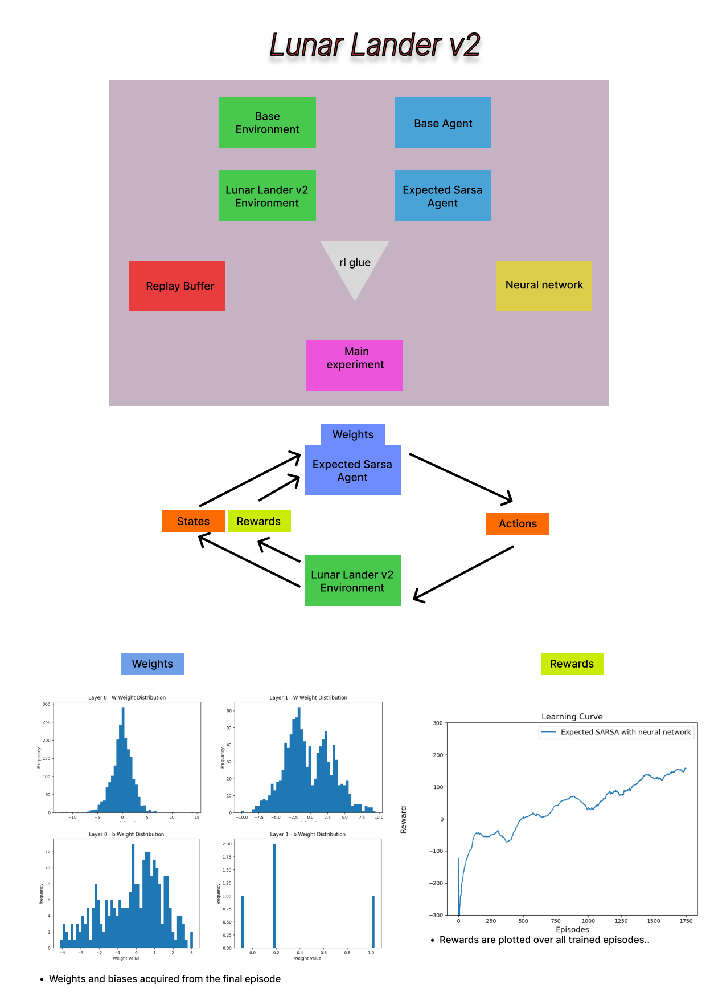

# Expected SARSA with Neural Network for Lunar Lander v2

This repository contains an implementation of the Expected SARSA reinforcement learning algorithm, enhanced with a neural network, to solve the Lunar Lander v2 environment from OpenAI Gym. This project serves as a capstone for the Reinforcement Learning specialization on Coursera.

## Project Overview

The Lunar Lander v2 is a popular environment in reinforcement learning where the goal is to safely land a spacecraft on the moon. The agent must learn to control the lander by firing its engines to counteract gravity and navigate to the landing pad. This implementation utilizes the Expected SARSA algorithm, combined with a neural network, to effectively learn policies that achieve successful landings.

## Features

- Implementation of Expected SARSA algorithm.
- Utilization of a neural network for function approximation.
- Customizable network architecture and learning parameters.
- Evaluation metrics to track the agent's performance over time.
- Ability to create .mp4 file with pretrained agent.
